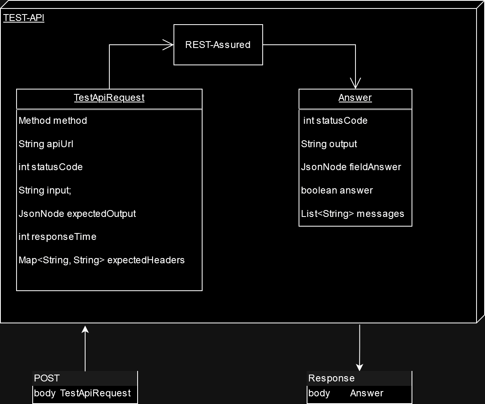

# TEST-API

TEST-API est un microservice permettant de tester des APIs avec [REST-assured](https://rest-assured.io/).
Il est destiné à être utilisé avec TAF (Test Automation Framework).

- [Getting started](#getting-started)
- [API Documentation](#api-documentation)
- [Usage](#usage)

## Getting started
### Install & Build

#### On your machine using Maven
> **Prerequisites :** have maven installed (hence java too)

Build & install with:
```shell
mvn clean install
```

Run with:
```shell
mvn spring-boot:run
```

#### Using Docker

> **Prerequisites :** Have docker installed

Build the image with:
```shell
docker build -t taf_testapi .
```

Run the docker container on your localhost at the port 8082:
```shell
docker run -p 127.0.0.1:8082:<REPLACE_WITH_YOUR_PORT> taf_testapi:latest
```

By default, the binded port for this application is 8082, hence the command would look like this:
```shell
docker run -p 127.0.0.1:8082:8082 taf_testapi:latest
```

### Port

Un port est configuré (dans ressources/application.yml) à 8082 par défaut, mais peut être modifié sans incidence sur le programme.
Dans ce cas il faut aussi modifier le port exposer par le dockerfile (`EXPOSE <REPLACE_WITH_YOUR_PORT>`).

### Interaction with TAF

Since you'll need TAF to run (since this is only a microservice), you should have a look at running the docker-compose.
The steps are defined in the source directory [README.md](../README.md).

## API Documentation



### Input

|    **Field**    |        **Type**        | **Description**                              |
|:---------------:|:----------------------:|:---------------------------------------------|
|     method      |        `Method`        | The HTTP request method (ex: GET, POST, ...) |
|     apiUrl      |        `String`        | The URL of the API to test                   |
|      input      |        `String`        | The body of the request (represent a JSON)   |
| expectedOutput  |       `JsonNode`       | The expected response                        |
|   statusCode    |         `int`          | The expected status code                     |
|  responseTime   |         `int`          | The expected response time                   |
| expectedHeaders | ` Map<String, String>` | The expected headers                         |

### Output

|  **Field**  |   **Type**    | **Description**                                                                                                                     |
|:-----------:|:-------------:|:------------------------------------------------------------------------------------------------------------------------------------|
| statusCode  |     `int`     | The output status code                                                                                                              |
|   output    |   `String`    | The response                                                                                                                        |
| fieldAnswer |  `JsonNode`   | The same fields than`expectedOutput`. The values are `true` if the field exist with the same value in `expectedOutput` and `output` |
|   answer    |   `boolean`   | The test output.                                                                                                                    |
|  messages   | `List<Sring>` | List of error messages                                                                                                              |

## Usage

```
POST http://localhost:8082/microservice/testapi/checkApi
Content-Type: application/json
Accept: application/json, text/plain, */*

{
  "method": "GET",
  "apiUrl": "https://md.edgar.bzh/status",
  "responseTime": 2000,
  "expectedOutput": {
    "onlineNotes": 1,
    "onlineUsers": 1,
    "distinctOnlineUsers": 1,
    "notesCount": 1428,
    "registeredUsers": 37,
    "onlineRegisteredUsers": 1,
    "distinctOnlineRegisteredUsers": 1,
    "isConnectionBusy": false,
    "connectionSocketQueueLength": 0,
    "isDisconnectBusy": false,
    "disconnectSocketQueueLength": 0
  },
  "statusCode": 200,
  "input": "",
  "expectedHeaders": {
    "x-powered-by": "Express",
    "hedgedoc-version": "1.9.3"
  }
}
```
